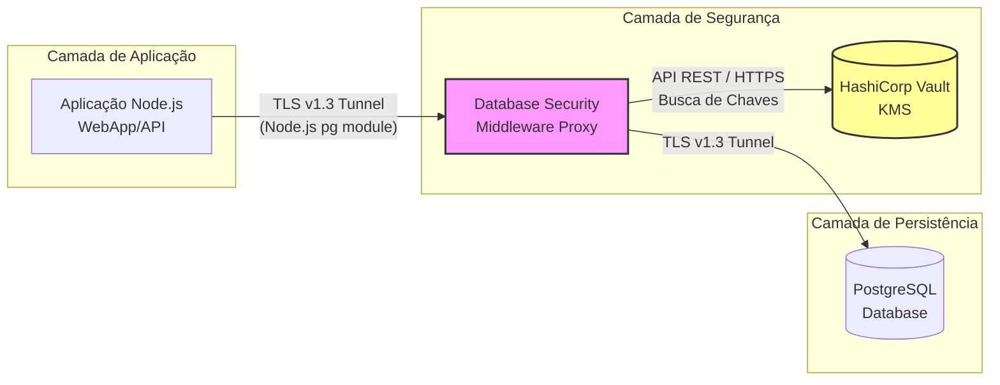

# Database Security Middleware - UFSC

<!-- Badges -->


<div align="center">
  <h3>Database Security Middleware </h3>
  <p>Sistema de Interceptação TCP e Criptografia em Rede para Bancos de Dados PostgreSQL.</p>
</div>

## Índice

- [Sobre o Projeto](#sobre-o-projeto)
- [Funcionalidades](#funcionalidades)
- [Tecnologias](#tecnologias)
- [Instalação](#instalação)
- [Uso](#uso)
- [Arquitetura](#arquitetura-do-projeto)
- [Estrutura do Projeto](#estrutura-do-projeto)
- [Licença](#licença)

## Sobre o Projeto

Um proxy TCP desenvolvido com base no conceito de Zero Trust Storage. O middleware intercepta, em tempo real, a comunicação entre a aplicação e o banco de dados por meio do protocolo PgWire, analisa as consultas SQL e criptografa automaticamente os campos sensíveis. Dessa forma, a aplicação continua funcionando normalmente, sem necessidade de alterações no código fonte.

### Objetivos

- Criptografar e descriptografar dados sensíveis de maneira invisível para a aplicação cliente.
- Permitir buscas em dados encriptados.
- Centralizar o armazenamento e o gerenciamento das chaves criptográficas utilizando um KMS, como o HashiCorp Vault.

## Funcionalidades

- Implementação de criptografia híbrida de envelope, utilizando AES-256-GCM para proteger os dados e RSA-2048 para criptografar a chave de dados (**Per-Row**)
- Implementação de um modo configurável via variável de ambiente para usar chave estática visado eficiência máxima de espaço em diso (**Shared DEK**)
- Descriptografia automática dos dados durante o retorno de consultas SELECT, utilizando a chave privada RSA antes do envio dos resultados à aplicação.
- Geração de hashes determinístico com HMAC-SHA256, permitindo consultas mesmo em colunas criptografadas.
- Integração nativa via HTTP com o HashiCorp Vault para geração, armazenamento e gerenciamento do par de chaves RSA.
- Suporte à terminação de conexões utilizando TLS.

## Tecnologias

### Middleware TCP

- **Linguagem:** Go 1.21
- **Dependência Principal:** `pganalyze/pg_query_go v6`
- **KMS:** HashiCorp Vault
- **Armazenamento:** PostgreSQL 16

### Ambiente de Demonstração

- Node.js 18 LTS
- Express.js 4
- pg (node-postgres)
- Vanilla Javascript + HTML/CSS

## Instalação

### 1. Clonando o repositório

```bash
git clone https://github.com/Clara-M-Grossl/2026.1_DEC0013_DATABASE-SECURITY-MIDDLEWARE.git
cd 2026.1_DEC0013_DATABASE-SECURITY-MIDDLEWARE
```

### 2. Inicialização da infraestrutura

A infraestrutura local foi configurada utilizando contêineres para realizar toda a orquestração dos serviços.

```bash
docker-compose up -d --build
```

Após a execução do comando, serão iniciados o  HashiCorp Vault , os nós do  PostgreSQL , os gateways de segurança e a aplicação web de testes, todos integrados à rede do Docker.

## Uso

### Explorando a Demonstração Visual

Após a inicialização dos serviços, acesse a interface web em `http://localhost:3000`. A aplicação simula o sistema de uma clínica médica e demonstra como o proxy TCP protege informações sensíveis, como o CPF dos pacientes, criptografando esses dados antes de serem armazenados no banco de dados.

---

### Utilizando o Middleware em Seu Projeto Próprio

Se você já possui um banco PostgreSQL e um HashiCorp Vault na sua infraestrutura, você pode inicializar apenas o Gateway de forma isolada.

**1. Rodando o Middleware**
Compile a imagem ou baixe-a, e suba o contêiner mapeando os IPs do seu ambiente real:

```bash
docker run -d \
  -p 8000:8000 \
  -e GATEWAY_LISTEN_PORT=8000 \
  -e GATEWAY_DB_HOST=<SEU_IP_POSTGRES> \
  -e GATEWAY_DB_PORT=5432 \
  -e VAULT_ADDR=http://<SEU_IP_VAULT>:8200 \
  -e VAULT_TOKEN=root \
  -v ./certs:/certs \
  security-gateway:latest
```

**2. Redirecionando sua Conexão**
Para utilizar o gateway, basta alterar a *connection string* da aplicação. Em vez de conectar o driver ou a ORM diretamente ao PostgreSQL (porta  **5432** ), a conexão deve ser direcionada para a porta do gateway ( **8000** ).

**3. Definindo as Colunas Protegidas**
A definição das colunas que serão protegidas por criptografia AES ou HASH é realizada por meio de metadados armazenados no próprio banco de dados, sem exigir qualquer alteração no código da aplicação.

```sql
-- Criptografa o conteúdo dessa coluna
COMMENT ON COLUMN usuarios.senha_ou_cpf IS 'gateway:encrypt';

-- Gera Blind Index
COMMENT ON COLUMN usuarios.email IS 'gateway:blind_index';
```

### Modos de Criptografia

Você pode ajustar o nível de segurança da criptografia alterando a variável de ambiente `MIDDLEWARE_ENCRYPTION_MODE` na inicialização do proxy.

**Modo Per-row**

* Modo padrão com criptografia híbrida RSA+AES
* Gera uma chave DEK para cada linha do banco, envelopando-a com a chave mestre RSA
* *Prós:* Alto nível de segurança. Caso uma DEK vaze, apenas uma linha é comprometida
* *Contra:* Cada dado consome cerca de 600 caracteres em Hexadecimal
* **A coluna no banco deve ser do tipo `TEXT`**

**Modo Shared**

* Modo otimizado, usa apenas AES-256-GCM.
* Usa apenas uma única chame simétrica compartilhada do Vault durante o boot.
* *Prós:* Os dados ficam com cerca de 78 caracteres.
* *Contra:* Uma mesma chave criptograda todo o banco.

## Arquitetura do Projeto

Fluxograma da disposição de redes e containers em operação:



## Estrutura do Projeto

```text
2026.1_DEC0013_DATABASE-SECURITY-MIDDLEWARE/
├── cmd/
│   └── middleware/             # main.go e listener
├── pkg/
│   └── middleware/             # Funcionamento Interno
├── demo/
│   └── web/              # Serviço web de demonstração
|
└── docker-compose.yml
```

## Licença

Distribuído sob a licença MIT.
