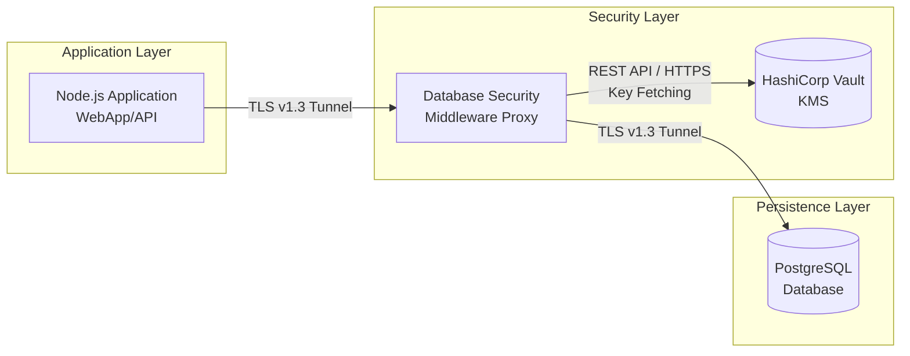

<div align="center">
  <h1>Database Security Middleware</h1>
  <h2>TCP Interception and Network Encryption System for PostgreSQL Databases</h2>
  <br>
  
  
  
  
  <br><br>
  
  
  
</div>

---

[Versão em Português](READMEPT.md) 

---

## About the Project

A TCP proxy developed based on the Zero Trust Storage concept. The middleware intercepts, in real-time, the communication between the application and the database through the PgWire protocol, parses SQL queries, and automatically encrypts sensitive fields. This allows the application to continue functioning normally without requiring any source code changes.

### Objectives

- Encrypt and decrypt sensitive data invisibly to the client application.
- Enable searching on encrypted data.
- Centralize the storage and management of cryptographic keys using a KMS, such as HashiCorp Vault.

## Features

- Implementation of hybrid envelope encryption, using AES-256-GCM to protect data and RSA-2048 to encrypt the data key - **Per-Row**
- Implementation of a configurable mode via environment variable to use a static key aimed at maximum disk space efficiency - **Shared DEK**
- Automatic decryption of data during `SELECT` query returns, using the RSA private key before sending results to the application.
- Deterministic hash generation with HMAC-SHA256, allowing queries even on encrypted columns.
- Native HTTP integration with HashiCorp Vault for the generation, storage, and management of the RSA key pair.
- Support for connection termination using TLS.

## Project Architecture

Flowchart of the network and container layout in operation:



## Encryption Modes

You can adjust the encryption security level by changing the `MIDDLEWARE_ENCRYPTION_MODE` environment variable at proxy startup.

**Per-row Mode**

* Default mode with hybrid RSA+AES encryption.
* Generates a DEK key for each database row, enveloping it with the RSA master key.
* *Pros:* High level of security. If a DEK leaks, only one row is compromised.
* *Cons:* Each data entry consumes about 600 characters in Hexadecimal.
* **The database column must be of type `TEXT`**

**Shared Mode**

* Optimized mode, uses only AES-256-GCM.
* Uses only a single symmetric key shared from Vault during boot.
* *Pros:* Data entries take up about 78 characters.
* *Cons:* A single key encrypts the entire database.

## Technologies

### TCP Middleware

- **Language:** Go 1.21
- **Main Dependency:** `pganalyze/pg_query_go v6`
- **KMS:** HashiCorp Vault
- **Storage:** PostgreSQL 16

### Test Environment

- Node.js 18 LTS
- Express.js 4
- node-postgres
- Vanilla Javascript + HTML/CSS

## Installation

### Cloning the repository

```bash
git clone https://github.com/Clara-M-Grossl/2026.1_DEC0013_DATABASE-SECURITY-MIDDLEWARE.git
cd 2026.1_DEC0013_DATABASE-SECURITY-MIDDLEWARE
```

After cloning the repository, you can choose to test the middleware in a test environment or run it standalone in your own application.

### Test Environment

For academic purposes, this repository includes a complete demonstration environment simulating a healthcare application and an e-commerce coupled to the proxy.

Follow the simulation instructions at: 
[demo/web/README.md](demo/web/README.md)

---

### In Your Own Project

If you already have a PostgreSQL database and HashiCorp Vault in your infrastructure, you can initialize only the Middleware in an isolated manner.

**1. Initializing the Middleware**
Start the infrastructure and adjust the environment variables with your database IPs:

```bash
docker-compose up -d --build
```

If you already have a complete infrastructure and want to run only the proxy container standalone via CLI:

```bash
docker run -d \
  -p 8000:8000 \
  -e MIDDLEWARE_LISTEN_PORT=8000 \
  -e MIDDLEWARE_DB_HOST=<YOUR_POSTGRES_IP> \
  -e MIDDLEWARE_DB_PORT=5432 \
  -e VAULT_ADDR=http://<YOUR_VAULT_IP>:8200 \
  -e VAULT_TOKEN=root \
  -e MIDDLEWARE_ENCRYPTION_MODE=shared \
  -v ./certs:/certs \
  security-middleware:latest
```
**Configuration Parameters:**

- `MIDDLEWARE_LISTEN_PORT`: The port where the Proxy will listen for your application's connections.
- `MIDDLEWARE_DB_HOST` and `PORT`: The actual IP and port where your physical PostgreSQL is running.
- `VAULT_ADDR`: The full URL of your HashiCorp Vault infrastructure.
- `VAULT_TOKEN`: The authentication token with permissions for cryptographic key management.
- `MIDDLEWARE_ENCRYPTION_MODE`: Set as `shared` (single symmetric key) or `per_row` (a unique key per row).
- `-v ./certs:/certs`: Mounting the local folder containing your TLS key pair.

**2. Redirecting your Connection**
To use the gateway, simply change your application's connection string. Instead of connecting the driver or ORM directly to PostgreSQL, the connection should be directed to the gateway port.

**3. Defining Protected Columns**
The definition of the columns to be protected by AES or HASH encryption is done through metadata stored within the database itself, without requiring any changes to the application code.

>[!NOTE]
> The `blind_index=true` tag informs the proxy that it must generate the necessary hashes to allow partial searches on the encrypted column.

```sql
-- Encrypts the content of this column
COMMENT ON COLUMN users.password_or_ssn IS 'middleware:encrypt';

-- Generates Blind Index
COMMENT ON COLUMN users.email IS 'middleware:blind_index';
```

> [!NOTE]
> **TLS Certificates Note:** The private key contained in the `certs/` folder exists solely to enable the execution of this local test environment without extra configurations. In a production environment, real certificates and security keys should never be versioned in Git.

## Project Structure

```text
2026.1_DEC0013_DATABASE-SECURITY-MIDDLEWARE/
├── certs/
├── cmd/
│   └── middleware/             # main.go and listener
├── demo/                       # Web demonstration service
│   ├── web/       
|   ├── docker-compose.yml          
|   └── README
├── docs/assets
├── pkg/
│   └── middleware/             # Inner Workings
├── vault/
├── docker-compose.yml
└── README
```

## License

Distributed under the MIT License.
