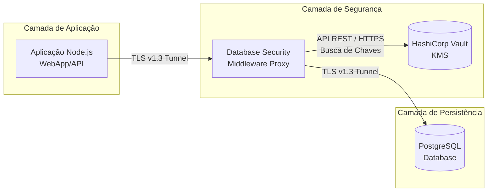

<div align="center">
  <h1>Database Security Middleware</h1>
  <h2>TCP Interception and Network Encryption System for PostgreSQL Databases</h2>
  <br>
  
  
  
  
  <br><br>
  
  
  
</div>


## Sobre o Projeto

Um proxy TCP desenvolvido com base no conceito de Zero Trust Storage. O middleware intercepta, em tempo real, a comunicação entre a aplicação e o banco de dados por meio do protocolo PgWire, analisa as consultas SQL e criptografa automaticamente os campos sensíveis. Dessa forma, a aplicação continua funcionando normalmente, sem necessidade de alterações no código fonte.

### Objetivos

- Criptografar e descriptografar dados sensíveis de maneira invisível para a aplicação cliente.
- Permitir buscas em dados encriptados.
- Centralizar o armazenamento e o gerenciamento das chaves criptográficas utilizando um KMS, como o HashiCorp Vault.


## Funcionalidades

- Implementação de criptografia híbrida de envelope, utilizando AES-256-GCM para proteger os dados e RSA-2048 para criptografar a chave de dados - **Per-Row**
- Implementação de um modo configurável via variável de ambiente para usar chave estática visado eficiência máxima de espaço em disco - **Shared DEK**
- Descriptografia automática dos dados durante o retorno de consultas SELECT, utilizando a chave privada RSA antes do envio dos resultados à aplicação.
- Geração de hashes determinístico com HMAC-SHA256, permitindo consultas mesmo em colunas criptografadas.
- Integração nativa via HTTP com o HashiCorp Vault para geração, armazenamento e gerenciamento do par de chaves RSA.
- Suporte à terminação de conexões utilizando TLS.

## Arquitetura do Projeto

Fluxograma da disposição de redes e containers em operação:



## Modos de Criptografia

Você pode ajustar o nível de segurança da criptografia alterando a variável de ambiente `MIDDLEWARE_ENCRYPTION_MODE` na inicialização do proxy.

**Modo Per-row**

* Modo padrão com criptografia híbrida RSA+AES
* Gera uma chave DEK para cada linha do banco, envelopando-a com a chave mestre RSA
* *Prós:* Alto nível de segurança. Caso uma DEK vaze, apenas uma linha é comprometida
* *Contra:* Cada dado consome cerca de 600 caracteres em Hexadecimal
* **A coluna no banco deve ser do tipo `TEXT`**

**Modo Shared**

* Modo otimizado, usa apenas AES-256-GCM.
* Usa apenas uma única chame simétrica compartilhada do Vault durante o boot.
* *Prós:* Os dados ficam com cerca de 78 caracteres.
* *Contra:* Uma mesma chave criptograda todo o banco.

## Tecnologias

### Middleware TCP

- **Linguagem:** Go 1.21
- **Dependência Principal:** `pganalyze/pg_query_go v6`
- **KMS:** HashiCorp Vault
- **Armazenamento:** PostgreSQL 16

### Ambiente de Teste

- Node.js 18 LTS
- Express.js 4
- node-postgres
- Vanilla Javascript + HTML/CSS

## Instalação

### Clonando o repositório

```bash
git clone https://github.com/Clara-M-Grossl/2026.1_DEC0013_DATABASE-SECURITY-MIDDLEWARE.git
cd 2026.1_DEC0013_DATABASE-SECURITY-MIDDLEWARE
```

Após clonar o repositório, você pode optar por testar o middleware em um ambiente de teste ou rodá-lo isoladamente em sua própria aplicação.

### Ambiente de Teste

Para fins acadêmicos, este repositório acompanha um ambiente completo de demonstração simulando uma aplicação de saúde e um e-commerce acoplada ao proxy.

Siga as instruções de simulação em: 
[demo/web/README.md](demo/web/README.md)

---

### Em Seu Projeto Próprio

Se você já possui um banco PostgreSQL e um HashiCorp Vault na sua infraestrutura, você pode inicializar apenas o Middleware de forma isolada.


**1. Inicializando o Middleware**
Inicie a infraestrutura e ajuste as variáveis de ambiente com os IPs do seu banco de dados:

```bash
docker-compose up -d --build
```

Caso você já tenha uma infraestrutura completa e deseja subir apenas o container do proxy isoladamente:

```bash
docker run -d \
  -p 8000:8000 \
  -e MIDDLEWARE_LISTEN_PORT=8000 \
  -e MIDDLEWARE_DB_HOST=<SEU_IP_POSTGRES> \
  -e MIDDLEWARE_DB_PORT=5432 \
  -e VAULT_ADDR=http://<SEU_IP_VAULT>:8200 \
  -e VAULT_TOKEN=root \
  -e MIDDLEWARE_ENCRYPTION_MODE=shared \
  -v ./certs:/certs \
  security-middleware:latest
```
**Parâmetros de Configuração:**

- MIDDLEWARE_LISTE_PORT: A porta onde o Proxy vai escutar as conexões da sua aplicação
- MIDDLEWARE_DB_HOST e PORT: O IP e porta reais onde o seu PostgreSQL físico está rodando
- VAULT_ADDR: A URL completa da sua infraestrutura do HashiCorp Vault
- VAULT_TOKEN: O token de autenticação com permissões para gerenciamento de chaves criptográficas
- MIDDLEWARE_ENCRYPTION_MODE: Defina como shared (chave simétrica única) ou per_row (uma chave única por linha)
- -v ./certs:/certs: Montagem da pasta local que contém o seu par de chaves TLS

**2. Redirecionando sua Conexão**
Para utilizar o gateway, basta alterar a *connection string* da aplicação. Em vez de conectar o driver ou a ORM diretamente ao PostgreSQL, a conexão deve ser direcionada para a porta do gateway.

**3. Definindo as Colunas Protegidas**
A definição das colunas que serão protegidas por criptografia AES ou HASH é realizada por meio de metadados armazenados no próprio banco de dados, sem exigir qualquer alteração no código da aplicação.

>[!NOTE]
> A tag `blind_index=true` informa ao proxy que ele deve gerar os hashes necessários para permitir buscas parciais na coluna criptograda

```sql
-- Criptografa o conteúdo dessa coluna
COMMENT ON COLUMN usuarios.senha_ou_cpf IS 'middleware:encrypt';

-- Gera Blind Index
COMMENT ON COLUMN usuarios.email IS 'middleware:blind_index';
```

> [!NOTE]
> Nota sobre Certificados TLS: A chave privada contida na pasta `certs/` existe apenas para viabilizar a execução deste ambiente local de testes sem configurações extras. Em um ambiente de produção, certificados e chaves de segurança reais nunca devem ser versionados no Git.

## Estrutura do Projeto

```text
2026.1_DEC0013_DATABASE-SECURITY-MIDDLEWARE/
├── certs/
├── cmd/
│   └── middleware/             # main.go e listener
├── demo/                       # Serviço web de demonstração
│   ├── web/       
|   ├── docker-compose.yml          
|   └── README
├── docs/assets
├── pkg/
│   └── middleware/             # Funcionamento Interno
├── vault/
├── docker-compose.yml
└── README
```

## Licença

Distribuído sob a licença MIT.
